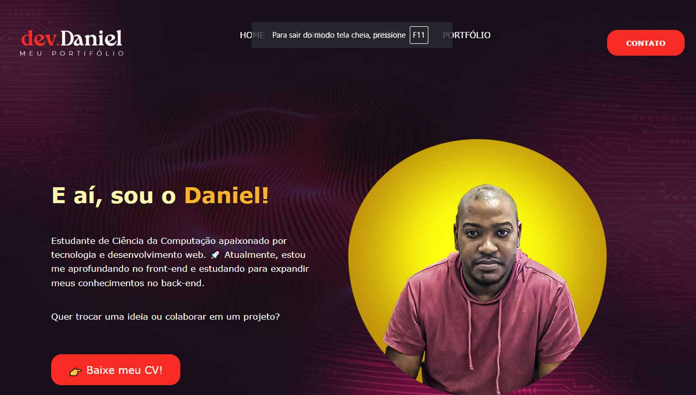

# 🌐 Meu Portfólio - dev.Daniel

Bem-vindo ao meu portfólio! 🚀  
Sou um estudante de **Ciência da Computação** apaixonado por tecnologia e desenvolvimento web.  
Atualmente, estou aprofundando meus conhecimentos no **front-end** e estudando para me tornar um **desenvolvedor back-end**.  

🔗 **Acesse meu portfólio:** [danyeljorge.github.io/meu-portifolio/](https://danyeljorge.github.io/meu-portifolio/)

---

## 🛠️ Tecnologias Utilizadas

- **Front-end:** HTML5, CSS3, JavaScript  
- **Frameworks & Bibliotecas:** Bootstrap  
- **Ferramentas:** Git, GitHub 

---

## 📌 O que você encontrará no meu portfólio?

- Sobre mim  
- Projetos que desenvolvi  
- Contato para parcerias ou oportunidades  

---

## 📩 Contato

Se quiser trocar uma ideia ou colaborar em um projeto, sinta-se à vontade para me chamar!  

📧 **E-mail:** [danyeljorge@outlook.com](mailto:danyeljorge@outlook.com)  
📱 **LinkedIn:** [linkedin.com/in/danieljorgee](https://www.linkedin.com/in/danieljorgee/)  

👨‍💻 Vamos construir algo incrível juntos! 🚀  